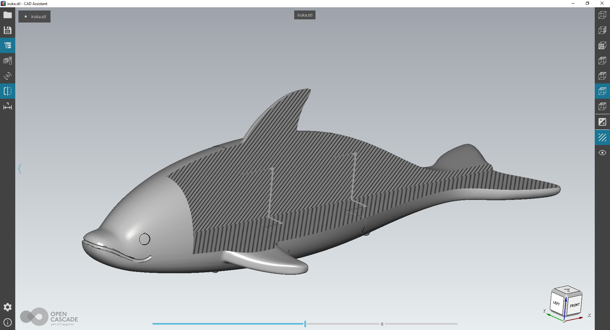
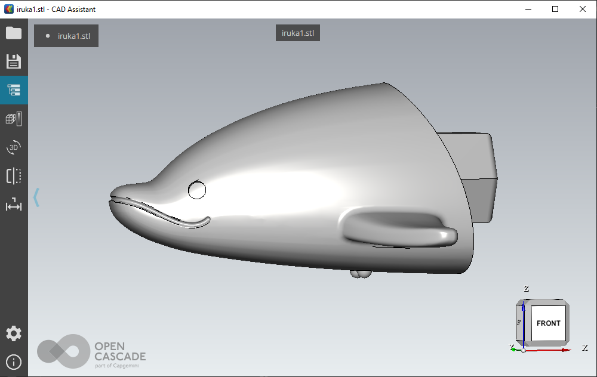
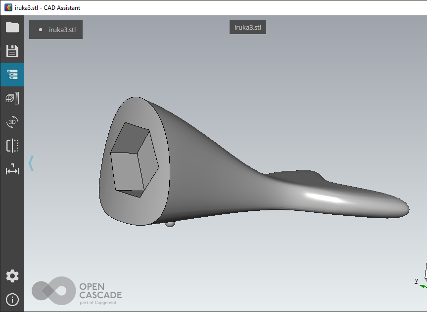
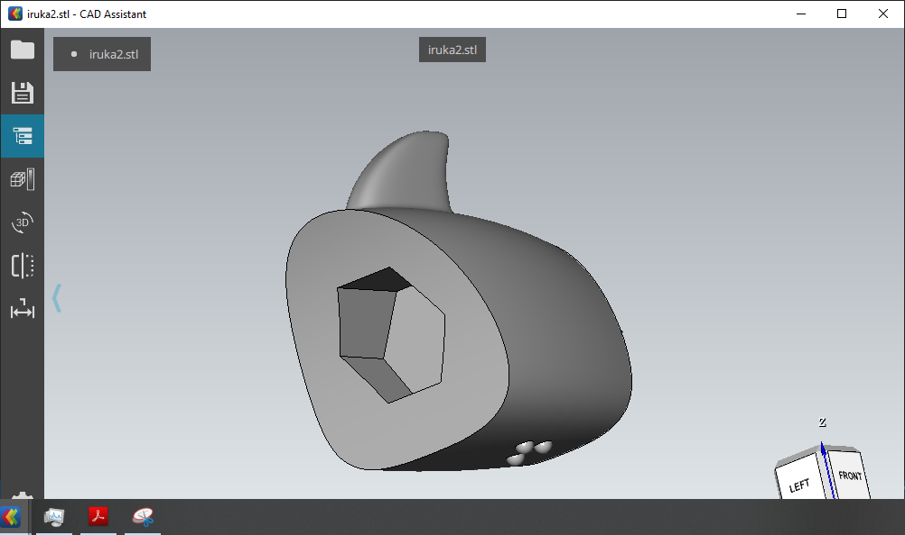

# note

- <http://www002.upp.so-net.ne.jp/latex/greece.html>
- <https://www.fujielectric.co.jp/about/company/jihou_2002/pdf/75-08/07.pdf>
- WSL2
  - <https://docs.microsoft.com/ja-jp/windows/wsl/wsl2-install>
  - Windows 10 18917
  - no serial support
  - <http://matsuneko22.hateblo.jp/entry/2017/12/09/144803>

WSL2 command as admin

```Markdown
Enable-WindowsOptionalFeature -Online -FeatureName VirtualMachinePlatform
Enable-WindowsOptionalFeature -Online -FeatureName Microsoft-Windows-Subsystem-Linux
```






Restart PC

WSL2

```Markdown
wsl -l
wsl --set-version <Distro> 2
```

Docker Pull

```Markdown
docker pull plass/mdtopdf
```

Docker CentOS

```Markdown
docker pull centos
time docker run centos /bin/echo "hello world"
```

## Liquefaction of helium

ヘリウムの液化に用いられる冷却方法
真空中に急激にヘリウムを押し込み、分子が広がるときに分子間力に引かれて押し込まれ気体分子の速度が減少する。
ジュール‐トムソン効果
ヘリウムの臨界点は5.2Kと特に低い。
いったん液体ができると、ポンプで気体を引いて圧力を下げる。圧力が下がると液体から蒸発が起こり、蒸発熱をまわりから吸収して温度を下げる。

Cooling method used for liquefaction of helium
Helium is suddenly pushed into the vacuum, and when the molecules spread, they are pushed by the intermolecular force and the velocity of the gas molecules decreases.
Joule-Thomson effect
Helium has a particularly low critical point of 5.2K.
Once liquid is formed, pump down the gas and reduce the pressure. When the pressure drops, the liquid evaporates, absorbing the heat of evaporation from the surroundings to lower the temperature.

## 高圧IGBT多直列技術

電力系統，産業プラント，電気鉄道などで適用される電力変換装置は高圧・大容量であるため，以前はサイリスタやGTO（Gate Turn-Off）サイリスタなどのデバイスが主流を占めていた。
一方，汎用インバータなどの比較的中小容量の変換装置にはIGBT（Insulated  Gate  BipolarTransistor）が広く適用されており，高性能化が図られている。

Since power converters used in power systems, industrial plants, electric railways, etc. have high voltage and large capacity, devices such as thyristors and GTO (Gate Turn-Off) thyristors used to dominate before.
On the other hand, IGBTs (Insulated Gate Bipolar Transistors) are widely applied to converters with relatively small and medium capacities, such as general-purpose inverters, to achieve higher performance.

デバイスを直列接続したときの最大の問題点は，各デバイスのスイッチングタイミングに差が生じたとき，各デバイスの素子電圧が不平衡となり，特定のデバイスに過大な電圧責務がかかることである。
IGBTの場合，他の電力用デバイスと比較すると，スイッチング速度が速く，素子電圧の不平衡が大きくなる傾向がある。
特にターンオフ時には，電流遮断時に発生する過渡電圧が主回路電圧に重畳するため，素子破壊を招く可能性が強くなる。
素子電圧の不平衡を抑制することが，IGBTを直列接続する際の最大の課題となる

The biggest problem with connecting devices in series is that when there is a difference in the switching timing of each device, the element voltages of each device become unbalanced, and a particular device takes an excessive voltage responsibility.
In the case of IGBTs, the switching speed tends to be faster and the device voltage unbalance tends to be larger than other power devices.
Particularly at the time of turn-off, a transient voltage generated at the time of current interruption is superimposed on the main circuit voltage, so that the possibility of destruction of the element is increased.
Suppressing device voltage imbalance is the biggest challenge when connecting IGBTs in series

直列接続されているIGBTのゲート線を，コア（以下，ゲートバランスコアという）によって磁気的に結合させ，スイッチング時に流れるゲート電流のタイミングをバランスさせるものである。その結果，素子電圧分担を均等化させることができる。

The gate lines of the IGBTs connected in series are magnetically coupled by a core (hereinafter, referred to as a gate balance core) to balance the timing of the gate current flowing during switching. As a result, element voltage sharing can be equalized.

## Check the battery consumption with a tester

電池に負荷抵抗をつないで調べる。
電池が実際に使われている状態を再現して電流が流れている時の、電池の端子電圧を測定する。
電池の内部抵抗は使えば使うほど大きくなる。
内部抵抗にかかる電圧分が低下した端子電圧になる。負荷をつけずに電流が流れると内部抵抗による電圧降下がないため(?)、負荷をつけないで電圧を測っても電池の消耗度は分からない。

Check by connecting the load resistance to the battery.
Measure the terminal voltage of the battery when the current is flowing, reproducing the state in which the battery is actually used.
The more the battery is used, the greater the internal resistance of the battery.
The voltage applied to the internal resistance becomes the reduced terminal voltage. If the current flows without a load, there is no voltage drop due to the internal resistance (?). Therefore, even if the voltage is measured without a load, the consumption of the battery is not known.

- 赤 - 左手 - 正極
- 黒 - 右手 - 負極
