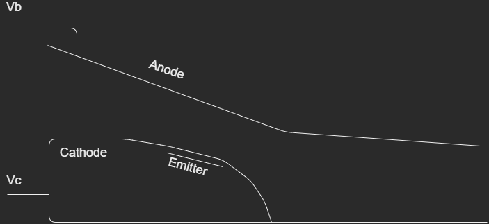
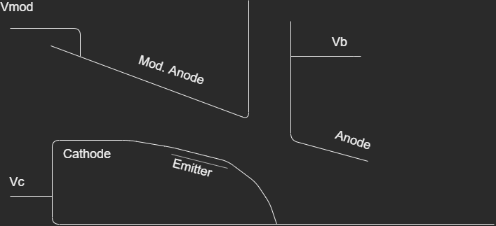

- Key components of Gyrotron
- investigate the influence of the quality of the emitter on the quality of electron beam nad gyrotron efficiency
- KIT in house code
  - ESRAY
  - ESPIC
- The nuemerical surface roughness model can be
  - used to simulate the influence of the surface roughness
  - on beam quality, gyrotron efficiency, and mode competition
  - calculated using the surface roughness model
- The emission inhomogeneity information can be
  - evaluated from the measured Current Voltage Characteristics CVCs
  - three methodss to evaluate the emission inhomogeneity from CVC
  - give the new definition of emission inhomogeneity
- Vacuum Electron Device VED
- Electron Beam Optics System EBOS
  - consisit of the MIG and beam tunnels of gyrotron
  - generate a hollow electron beaqm for the cavity with sufficient traverse volicity $v_{T}$

## 1. MIG

MiG type
| Diode                             | Triode                             |
| --------------------------------- | ---------------------------------- |
|  |  |

- MIG ususally, impognated dispenser emitter are used in high power gyrotron
  - Impregnated dispenser emitters are made of porous tungsten impregnated with metal oxides.
  - porous tangsten matrix acts as a reservoir
    - from which the emitting material
    - can diffuse to the surface
    - maintain an active layer
    - provide a low work function for thermionic emission of electrons.
  - B-type / S-type / M-type
- The thermonic emiter will first work under the space charge limited region
  - and the works in saturation region or temperature limited region
  - Under the space charged limited region
    - the current density of parallelplate diode
    - can be described using Child-Languir-eq

$$ \begin{aligned}
    J_{C-L} &= \frac{4\epsilon_0}{9} \sqrt{\frac{2e}{m_e}} \frac{V_0^{3/2}}{d^2} \\
    &= A_{C-L} V_0^{3/2}
\end{aligned} $$

- Dispenser emitter are desighned to work under temperature limited region
- ディスペンサーエミッターは、温度が制限された領域で動作するように設計されています
- The current density of thermionic emitter unde temperature limited region
  - can be described using Richardson-Dushman-eq with Schottky modification

$$ \begin{aligned}
    J_S &= A_g T^2 e^{ -\frac{W - \Delta W}{k_B T}} \\
    \Delta W &= \frac{e^3 E}{4\pi\epsilon_0}
\end{aligned} $$

- $E$ is the electric field on the emitter surface
- $k_B$ is Boltsmann constant
- $A_g = \lambda_R A_0 A_0$ is universal constant $=1.20173 10^6 Am-2K-2$
- $\lambda_R$ is a material-specific correction effect is typically 0.5
- When to set $\Delta W = 0$,
  - if Schottky effect is not taken into account
  - which means the influence of electric field in neglacted

- Typically working temperatures of thermonic emitter are around 1000 degree.
- As such high temperature and additional strong electric field,
  - electrons can overcome the surface barrier and,
  - can escape from the emitter surface.
- Typycally current density on emitter surface on morden cathodes
  - is in a range from 1 A/cm^2 ~ 5A/cm^2.
- The beam current is adjusted by
  - the tempareture of the emitter and the emitter source.

- After electrons leave the emitter,
  - their movemonets will be affected by
    - the electric field and magnetic field
    - Lorentzs force equation

$$ F = -e (E + v \times B) $$

- the electron gyrating around the guideing magnetic field.
- the magnetic field force only charges the direction of electrons and
  - it will not change the energy of the electron
- The Larmour radius
  - the distance between the actual spiral trajectory and
  - the guiding centre of gyrating electron

$$ r_L = \frac{\gamma m_e v_{\perp}}{e B} $$

- $\gamma=1/\sqrt{1-\beta^2}$: Lorentzs factor
- $\beta$ is velocity of electron in gyrotron
  - normalized to the speed of light

$$ \beta = \frac{v}{c_0} $$

- At the beginning og movements
  - the electron will be accelerated by anode voltage to
  - high axial velocity component $\beta_{\parallel}$.
  - low rotational velocity component $\beta_{\perp}$.
- Electron gyrate along the magnetic field lines
  - after the acceleration
  - come up with smoothly incresing magnetic field
- According Bosch's theorem
  - relation between radius $r_b$ and magnetic field

$$ \frac{r_b(z_2)}{r_b (z_1)} \approx \sqrt{\frac{B(z_1)}{B(z_2)}} $$

## 2. Cavity

- After the electron have reached the cavity region along the magnetic fied line
  - the cyclotron interaction will take place
  - the electro-magnetic field in cylindical waveguide is descrived by
    - TE and TM mode
  - TM Mode
    - the travaerse field component
    - $E_{\phi}$,$E_{r}$ vanish in a long cavity
    - with resonance close to cut-off
    - Consequently,
    - no-efficient energy exchange with traverse velocity component of electron is possible.
    - Stable and efficietn gyrotorn operation is only possible TE modes.
    - beacause
    - their traverse field component do not vanish.
  - TE Mode
    - electron can both accelerated and deaccelerated during their gyration
    - typical position of gyrating electron in electric field
      - decelerating: Left
      - accelerating: Right
    - When the electron is in Left Position
      - deccelerated by the electric field of microwaves and lose energy to the field
      - decrease the velocity, Lorentzs factor $\gamma$ will decrease
      - the angular frequncy of electron $\Omega_c = 2\pi f_{ce}$ will increase
        - due to the relativistic effect
    - When the electron is in Right Position
      - the electron is accelerating by electric field and $\Omega_c$ will decrease

## Key-Word

- CVC Current Voltage Charactristics
- Tonnerre model
  - smooth transition between
    - the space charge limited region and
    - the temperature limited region of CVC curve
  - results from the work function distribution of the emitter

## Program

- quasi-static PIC (Particle in Cell)
  - QuickPIC <https://github.com/UCLA-Plasma-Simulation-Group/QuickPIC-OpenSource.git>
    - Fortran
  - ESPIC
    - Gyrotron electron gun and collector simulation with ESRAY beam optics code
- ARIADNE
