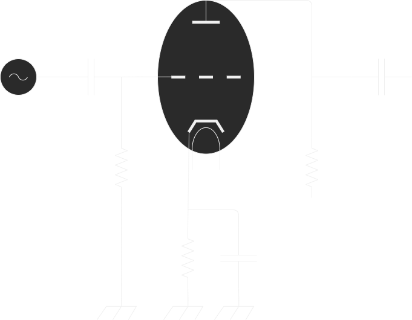

- [1. RF Device](#1-rf-device)
- [2. Waveguide](#2-waveguide)
  - [2.1. Rectanguler Waveguide](#21-rectanguler-waveguide)
  - [2.2. Circuler Waveguide](#22-circuler-waveguide)
  - [2.3. Corrugated Circuler Waveguide](#23-corrugated-circuler-waveguide)
  - [2.4. Coaxial Waveguide](#24-coaxial-waveguide)
- [3. Optics](#3-optics)
  - [3.1. Gaussian Optics](#31-gaussian-optics)
- [4. MoM](#4-mom)
  - [4.1. Circularly polarized antenna](#41-circularly-polarized-antenna)
- [5. Irregular Waveguide](#5-irregular-waveguide)
- [6. 三極管制御](#6-三極管制御)
- [7. GTD Geometrical Theory of Diffraction](#7-gtd-geometrical-theory-of-diffraction)
- [8. Directive Coupler](#8-directive-coupler)
- [9. Frequency Band](#9-frequency-band)
- [10. Micro Wave Band](#10-micro-wave-band)

Dielectric constant of lossy medium
$$ \epsilon_r = \epsilon_r^{\prime} - j\epsilon_r^{\prime\prime} $$

Relative permeability of lossy medium
$$ \mu_r = \mu_r^{\prime} - j\mu_r^{\prime\prime} $$

Propagation constant $\gamma$
$$\begin{aligned}
  \gamma = \alpha + j\beta
  &=& j \frac{\omega}{c_0} \sqrt{\epsilon_r\mu_r} \\
  &=& j \frac{2\pi}{\lambda_0} \sqrt{\epsilon_r\mu_r}
\end{aligned}$$

- Radio wave propagation inside conductive material

When an electric field is applied to Loss Medium has Specific Induction Rate $\epsilon_e$, Conductivity $\sigma$, a Current ($J=\sigma E$) due to conductivity flows in addition to the Displacement Current ($j\omega D$) due to the Electric field $E$ in the lossy medium.

$$\begin{aligned}
  D^* = \frac{1}{j\omega}J + D
  &=& \frac{1}{j\omega}\sigma E + \epsilon_0\epsilon_e E \\
  &=& \epsilon_0(\frac{\sigma}{j\omega\epsilon_0} + \epsilon_e)E \\
  &=& \epsilon_0\epsilon_r E
\end{aligned} $$

Dielectric Constant of conductive material $\epsilon_r$ can be expressed in a form that includes $\sigma$.

$$ \epsilon_r = \epsilon_e - j\frac{\sigma}{\omega\epsilon_0} $$

If $\sigma$ is large, the real part of the relative permittivity can be omitted.

$$ \begin{aligned}
  \epsilon_r
  &\approx& -j\epsilon_r^{\prime\prime} \\
  &=& -j\frac{\sigma}{\omega\epsilon_0}
\end{aligned} $$

$\epsilon_r^{\prime\prime}$ is inversely proportional to $\omega$. This characteristic is unique to a Conductive Material. If the imaginary part is inversely proportional to $\omega$ by measuring the dielectric constant of a material, the material is a conductive material.  
The propagation constant of the large $\sigma$ loss media is as follows.

$$\begin{aligned}
  \gamma
  &=& j \frac{\omega}{c_0} \sqrt{\epsilon_r\mu_r} \\
  &=& j \frac{\omega}{c_0} \sqrt{-j\frac{\sigma\mu_r}{\omega\epsilon_0}} \\
  &=& j \frac{\omega}{c_0} \frac{1-j}{\sqrt{2}} \sqrt{\frac{\sigma\mu_r}{\omega\epsilon_0}} \\
  &=& (1+j) \sqrt{\frac{1}{c_0^2} \frac{\omega\sigma\mu_r}{2\epsilon_0}} \\
  &=& (1+j) \sqrt{\epsilon_0\mu_0 \frac{\omega\sigma\mu_r}{2\epsilon_0}} \\
  &=& (1+j) \sqrt{\frac{\omega\sigma\mu_0\mu_r}{2}} \\
  &=& \frac{1+j}{\delta}
\end{aligned}$$

$\delta$ is called the skin depth.
$$ \delta = \sqrt{\frac{2}{\omega\sigma\mu_0\mu_r}} $$
In particular,
$$ \alpha = \beta = \frac{1}{\delta} $$

One of the characteristics of a conductive medium having a large sigma is that both $\alpha$ and $\beta$ are large and equal.  
The Surface Resistance $R_s$ is expressed as follows.

$$ R_s = \frac{1}{\sigma\delta} $$

The power $P_l$ transmitted from the surface into the conductive medium is expressed as follows.

$$\begin{aligned}
  P_l
  &=& \frac{1}{2} \frac{1}{\sigma\delta} |H_{t0}|^2 \\
  &=& \frac{1}{2} R_s |I_x|^2
\end{aligned}$$

Frequency
|    Freq |           t [s] |        t [ms] |      t [us] |  t [ns] |
| ------: | --------------: | ------------: | ----------: | ------: |
|    1 Hz |           1.0 s |
|    2 Hz |           0.5 s |
|   1 kHz |      1 / 1000 s |        1.0 ms |
|   5 kHz |      1 / 5000 s |        0.2 ms |      200 us |
|  10 kHz |    1 / 10,000 s |        0.1 ms |      100 us |
|  20 kHz |    1 / 20,000 s |       0.05 ms |       50 us |
|  30 kHz |    1 / 30,000 s |       0.03 ms |       33 us |
| 100 kHz |                 |    1 / 100 ms |       10 us |
|   1 MHz |    1 / $10^6$ s |   1 / 1000 ms |        1 us |
|   2 MHz |                 |               |      0.5 us |  500 ns |
|   5 MHz |                 |               |      0.2 us |  200 ns |
|  10 MHz |                 |               |      0.1 us |  100 ns |
|  20 MHz |                 |               |     0.05 us |   50 ns |
| 200 MHz |                 |               |             |    5 ns |
|   1 GHz |    1 / $10^9$ s | 1 / $10^6$ ms | 1 / 1000 us |    1 ns |
| 100 GHz | 1 / $10^{11}$ s | 1 / $10^8$ ms |             | 0.01 ns |

- [us] mean [$\mu s$]

Frequency Wavelength Time
|    Freq |         Wave |     Time |
| ------: | -----------: | -------: |
|    1 Hz | 299,792.5 km |  1.0 sec |
|    2 Hz | 149,896.2 km |  0.5 sec |
|   1 kHz |   299.792 km |   1.0 ms |
|   5 kHz |    59.958 km |   0.2 ms |
|  10 kHz |    29.979 km |   0.1 ms |
|  30 kHz |     9.993 km |    33 us |
|   1 MHz |    299.792 m |     1 us |
|   1 GHz |   299.792 mm | 0.001 us |
| 100 GHz |     2.998 mm |  0.01 ns |
| 200 GHz |     1.499 mm | 0.005 ns |

Conductivity
|      Material       | class          | $\sigma$ [S/m] |
| :-----------------: | :------------- | -------------: |
|         SiC         | Semi-Conductor |
|     Micro-Fiber     | Semi-Conductor |       ~ 7.8E-4 |
|      Sapphire       | Semi-Conductor |       ~ 5.5E-4 |
|      Sea Water      | Semi-Conductor |          ~ 4.0 |
|        GaAs         | Semi-Conductor |      ~ 2.38E-7 |
| Intrinsic Germanium | Semi-Conductor |        ~ 2.227 |
|   Distilled Water   | Insulator      |       ~ 1.0E-4 |
|     Fresh Water     | Semi-Conductor |       ~ 1.0E-2 |
|    Fused Quartz     | Insulator      |      ~ 1.0E-17 |
|     Ceresin Wax     | Insulator      |      ~ 1.0E-17 |
| Human Animal Tissue | Semi-Conductor |    ~ 0.2 - 0.7 |
|       Silver        | Conductor      |         6.1E+7 |
|       Copper        | Conductor      |        5.76E+7 |
|        Gold         | Conductor      |         4.1E+7 |
|    Silicon Steel    | Conductor      |         2.0E+6 |

Dierectric
|     Material     | $\epsilon'_r$ | $\tan(\delta)$ |
| :--------------: | ------------: | -------------: |
| Dehydrated Water |             1 |              0 |
|       Air        |        1.0006 |
|     Sillicon     |          11.8 |
|      Teflon      |           2.1 |         3.0E-4 |
|      Rubber      |        2.5E-3 |         2.0E-3 |
|      Nylon       |           3.5 |         2.0E-2 |
|   Fused Silica   |           3.8 |         7.5E-4 |
| Distrilled Water |            80 |         4.0E-2 |
|    Sea Water     |            81 |           4.62 |

## 1. RF Device

- ミリ波回路デバイス
- 周波数変換器
  - Hetero-Dyne
    - ヘテロダイン方式
    - IF回路が必要
    - 受信感度がHomo-Dyneに比べて高い
  - Homo-Dyne
    - ホモダイン方式
    - IF回路が必要ない
    - 部品点数を削減できマルチバンド化が容易
    - System on Chip SOC化が容易
- 変調器
  - I/Q直交変調
  - 極座標変調(ポーラ変調)
    - 振幅変調と位相変調の組み合わせ
    - 振幅変調　増幅器の直接制御
    - 位相変調　発振器の周波数変調器を時間積分する
- 電力増幅器
  - パラメータ
    - 出力レベル
    - 非線形性
    - 雑音指数
    - 帯域幅
    - DC-RF電力効率
  - Doherty増幅器
  - Linear Amplification using Non-Linear Comonents LINC増幅器
  - ひずみ補正技術
    - 入力複素包絡線の瞬時値
    - 入力複素包絡線のメモリ効果
    - 隣接する周波数帯域への漏洩電力の削減につながる技術
    - <http://www.oit.ac.jp/elc/~kumamoto/radio/06.pdf>
- 発振器
  - 発振器の雑音
  - Amplitude Modulation AM雑音
  - Phase Modulation PM雑音
  - 支配的な雑音はPM雑音
    - 発振器が自律システムであるため
  - Frequnecy Modulation 発振器の周波数変調
    - Digital Control Oscillator デジタル制御

## 2. Waveguide

### 2.1. Rectanguler Waveguide

<https://www.everythingrf.com/tech-resources/waveguides-sizes>

| EIA | Band [GHz] | Cutoff Low | Cutoff Next |      A x B [mm] |
| --- | ---------: | ---------: | ----------: | --------------: |
| WR8 |   90 ~ 140 |     73.768 |     147.536 |  2.032 x 1.0160 |
| WR6 |  110 ~ 170 |     90.791 |     181.583 |  1.651 x 0.8255 |
| WR7 |  110 ~ 170 |     90.791 |     181.583 |  1.651 x 0.8255 |
| WR5 |  140 ~ 220 |    115.714 |     231.429 | 1.2954 x 0.6477 |

- Waveguide Standard
  - MIL-Spec - United States Military Standard
  - IEC - International Electrotechnical Commission
  - EIA - Electronic Industries Alliance
  - RCSC - Radio Components Standardization Committee

### 2.2. Circuler Waveguide

- [waveguide](https://www.qwed.eu/CircularWaveguides.pdf)
- Cutoff
  - $$ f_{c, m, n} = \frac{\nu}{2 \pi} \beta_{c, m, n} $$
- TE (H) - mode
  - $$ \beta_{c, m, n} = \frac{\chi^{'}_{m, n}}{a} $$
- TM (E) - mode
  - $$ \beta_{c, m, n} = \frac{\chi_{m, n}}{a} $$
- $TE_{11}$ mode
  - $$ f_{c, TE_{1, 1}} = \frac{c}{2 \pi} \beta_{c, TE_{1, 1}} = \frac{c}{2 \pi} \frac{\chi^{'}_{1, 1}}{a} $$
- $TM_{01}$ mode
  - $$ f_{c, TM_{0, 1}} = \frac{c}{2 \pi} \beta_{c, TM_{0, 1}} = \frac{c}{2 \pi} \frac{\chi_{0, 1}}{a}$$

### 2.3. Corrugated Circuler Waveguide

### 2.4. Coaxial Waveguide

- WG Mode
  - Eigenmodes: $e_{mn}$.
  - Basis Function at WG aperture: $\hat{Z} \times e_{mn}$.
  - Wave Admittance: $Y_{mn}$.
  - $\beta$ is imaginary part of Propagation Constant $\gamma=\alpha + j\beta$.
  - TE
    - $$ e_{mn}^{TM} = -\nabla_t \Phi_{mn}$$
    - $$ Y_{mn}^{TM} = \frac{H_y}{E_x} = \frac{\beta}{\omega\mu_0} $$
  - TM
    - $$ e_{mn}^{TE} = \hat{z} \times \nabla_t \Psi_{mn}$$
    - $$ Y_{mn}^{TE} = \frac{H_y}{E_x} = \frac{\omega\epsilon}{\beta} $$
  - TEM
    - interior conductor transverse electric and magnetic (TEM) modes
- Circular WG
  - $$ \Phi_{mn} = \sqrt{\frac{\epsilon_m}{\pi}} \frac{J_m(\frac{\chi_{mn}\rho}{a})}{\chi_{mn}J_{m+1}(\chi_{mn})} \cos(m\phi) $$
  - $$ \Psi_{mn} = \sqrt{\frac{\epsilon_m}{\pi}} \frac{1}{\sqrt{\chi_{mn}^{\prime2} - m^2}} \frac{J_m(\frac{\chi_{mn}^{\prime}\rho}{a})}{J_{m}(\chi_{mn}^{\prime})} \cos(m\phi) $$
  - $$ \nabla_t = (\hat{\rho}\frac{\partial}{\partial\rho} + \hat{\Phi}\frac{1}{r}\frac{\partial}{\partial\phi})$$
  - $$ \epsilon_m = \begin{array}{l} 1 & (m=0) \\2 & (m\neq0) \end{array} $$
  - TM
    - $$ e_{mn}^{TM} = \sqrt{\frac{\epsilon_m}{\pi}} \frac{1}{|J_{m+1}(\chi_{mn})|} [ \mp \hat{\rho} \frac{J_m^{\prime}(\frac{\chi_{mn}\rho}{a})}{a} \cos(m\phi) + \hat{\Phi} \frac{m}{\chi_{mn}}\frac{J_m(\frac{\chi_{mn}\rho}{a})}{\rho} \sin(m\phi) ] $$
  - TE
    - $$ e_{mn}^{TE} = \sqrt{\frac{\epsilon_m}{\pi}} \frac{1}{\sqrt{\chi_{mn}^{\prime2}-m^2} |J_m(\chi_{mn}^{\prime})|} [ \pm \hat{\rho} m \frac{J_m(\frac{\chi_{mn}^{\prime}\rho}{a})}{\rho} \cos(m\phi) - \hat{\Phi} \chi_{mn}^{\prime} \frac{J_m^{\prime}(\frac{\chi_{mn}^{\prime}\rho}{a})}{\rho} \sin(m\phi) ] $$
- Coaxial WG
  - $$ \Phi_{mn} = Z_{mn} (\chi_i\frac{\rho}{b}) \cos(m\phi) $$
  - $$ \Psi_{mn} = \mathbb{Z}_{mn} (\chi_i^{\prime}\frac{\rho}{b}) \cos(m\phi) $$
  - $$ \nabla_t = (\hat{\rho}\frac{\partial}{\partial\rho} + \hat{\Phi}\frac{1}{r}\frac{\partial}{\partial\phi})$$
  - $$ Z_{m} (\chi_i\frac{\rho}{b}) = \frac{\sqrt{\pi\epsilon_m}}{2} \frac{J_m(\chi_i\frac{\rho}{b}) N_m(\chi_i) - N_m(\chi_i\frac{\rho}{b}) J_m(\chi_i)}{\sqrt{\frac{J_m^2(\chi_i)}{J_m^2(c\chi_i)}-1}} $$
  - $$ \mathbb{Z}_{m} (\chi_i^{\prime}\frac{\rho}{b}) = \frac{\sqrt{\pi\epsilon_m}}{2} \frac{J_m(\chi_i^{\prime}\frac{\rho}{b}) N_m^{\prime}(\chi_i^{\prime}) - N_m(\chi_i^{\prime}\frac{\rho}{b}) J_m^{\prime}(\chi_i^{\prime})}{\sqrt{[\frac{J_m^{\prime2}(\chi^{\prime}_i)}{J_m^{\prime2}(c\chi^{\prime}_i)}]^2[1-(\frac{m}{c\chi^{\prime}})^2]-[1-(\frac{m}{\chi^{\prime}})^2]}} $$
  - $$ \epsilon_m = \begin{array}{l} 1 & (m=0) \\2 & (m\neq0) \end{array}$$
  - $\chi_i=\chi_{mn}$ is n'th root of $Z_m(c\chi_i)$
  - $\chi_i^{\prime}=\chi_{mn}^{\prime}$ is n'th root of $\mathbb{Z}_{m}(c\chi_i^{\prime})$
    - i.e
    - $\mathbb{Z}_{mn}^{\prime}(\rho\frac{\chi_i^{\prime}}{b})|_{\rho=a}=0$
  - $$ Z_{m}^{\prime} (\chi_i^{\prime}\frac{\rho}{b}) = C_1 [J_{m}^{\prime} (\chi_i\frac{\rho}{b}) N_m(\chi_i) - N_{m}^{\prime} (\chi_i\frac{\rho}{b}) J_m(\chi_i^{\prime})]$$
  - $$ \mathbb{Z}_{m}^{\prime} (\chi_i^{\prime}\frac{\rho}{b}) = C_2 [J_{m}^{\prime} (\chi_i^{\prime}\frac{\rho}{b}) N_m^{\prime}(\chi_i^{\prime}) - N_{m}^{\prime} (\chi_i^{\prime}\frac{\rho}{b}) J_m(\chi_i^{\prime})]$$
  - $\chi_i$ and $\chi_i^{\prime}$ can be found as the respective roots
    - $$ J_{m}(c\chi_i) N_m(\chi_i) - N_{m}(c\chi_i) J_m(\chi_i) = 0 $$
    - $$ J_{m}^{\prime} (c\chi_i^{\prime}) N_m^{\prime}(\chi_i) - N_{m}^{\prime} (c\chi_i^{\prime}) J_m^{\prime}(\chi_i^{\prime}) = 0 $$
  - TM
    - $$ e_{mn}^{TM} = + \hat{\rho} \frac{\chi_i}{b} Z_m^{\prime}(\chi_i\frac{\rho}{b}) \cos(m\phi) - \hat{\Phi} \frac{m}{\rho} Z_m(\chi_i\frac{\rho}{b}) \sin(m\phi) $$
  - TE
    - $$ e_{mn}^{TE} = + \hat{\rho} \frac{m}{\rho} \mathbb{Z}_{mn}(\chi_i\frac{\rho}{b}) \cos(m\phi) - \hat{\Phi} \frac{\chi_i}{b} \mathbb{Z}_{mn}^{\prime}(\chi_i\frac{\rho}{b}) \sin(m\phi) $$
  - TEM
    - $$ e^{TEM} = - \hat{\rho} \frac{1}{\rho\sqrt{2\pi \ln(c)}}$$

## 3. Optics

- Field Expressions for the Electric and Magnetic short dipoles
- well known (e.g. [Stratton, 1941] or [Hansen, 1988].
- Here we will only give the expression for the Huygens source at large distances r,
- $$ E (r, \theta, \phi) = E_0 \frac{\exp(-jkr)}{r} (1 + \cos\theta) (\cos\phi\hat{\Theta} - \sin\phi\hat{\Phi} ) $$
- complex position $(x, y, z) = (0, 0, 0 - jb)$
  - $$ R = \sqrt{x^2 + y^2 + z^2 -b^2 + 2jbz} $$
- In Case,
  - $$ \rho^2 = \sqrt{x^2+y^2} $$
  - $$ z = r\cos \theta $$
  - $$ b \ll r = \sqrt{x^2 + y^2 + z^2} $$
  - Find
  - $$ R \cong \sqrt{ r^2 + j2br\cos\theta} \cong r + jb\cos\theta $$
  - Re-Define
  - $$ u = \exp(kb\cos\theta) \frac{\exp(-jkr)}{r} $$
  - $$ E (r, \theta, \phi) = N_f \exp(kb\cos\theta) \frac{\exp(-jkr)}{kr} (1 + \cos\theta) (\cos\phi\hat{\Theta} - \sin\phi\hat{\Phi} ) $$
  - Beam width is controlled by the parameter $b$
  - set $AdB (A < 0)$ at angle $\theta$
  - $$ b = \frac{20 \log_{10}((1+\cos\theta)/2) - A}{20k(1-\sin\theta)\log_{10}e} $$
  - $$ A = 20 \log_{10}((1+\cos\theta)/2) - 20bk(1-\sin\theta)\log_{10}e$$

### 3.1. Gaussian Optics

## 4. MoM

- The integral equation used for PEC objects is known
  - as the Mixed-Potential Electric Field Integral Equation (EFIE) formulation.
  - $$ \hat{n} \times E^{i} = \hat{n} \times L_{0} J_{s} $$
  - $$ L_{0}J_{S} = j\omega\mu_0 (\int_{S} J_{S}(r')G_{0}(r, r') dS' + \frac{1}{k_0^2}\int_{S} \nabla_{S}^{'}\cdot J_{S}(r') \nabla G_{0}(r, r') dS') $$
- Galerkin Finite Element Method

- FEM and MoM
  - <https://www.edaboard.com/showthread.php?62777-FEM-Vs-MoM-a-discussion>
  - two major numerical technique that EM Modeling
  - the results produced by FEM are much better when compared experimentally than by MoM
  - need a couple of real time facts/reasons that prove FEM performs better than MoM
  - FEM is a volume meshing approach
    - Volume meshing is more appropriate for most 3-D arbitrary geometries
    - FEM cells are large and its matrix is very large
    - but
    - it is generally a sparse matrix and can easily be solved using iterative solvers
  - MoM is usually a surface meshing approach
    - specialized to planar geometries and is more appropriate for most planar geometries
    - MoM the excitation modelling is generally a problem and we have to model the exact excitation
    - the Green's function is a sum of sines and cosines
      - There are no nasty integrations

- Higher Order Hierarchical Legendre Basis Functions for Electromagnetic Modeling
  - Divergence-conforming basis functions
    - impose normal continuity of a vector quantity
    - such as the electric surface current density in MoM
  - whereas
  - Curl-conforming functions
    - impose tangential continuity are applied FEM
  - High Order Function category
    - Interpolatory
      - interpolate the value of a field quantity at a number of interpolation points
        - s.t only one function is non-zero at the interpolation points
      - Direct physical interpretation of the unknown coefficients
      - limited the expansion order
        - must be kept constant throughout the mesh
        - thus  requiring a mesh with equally sized elements
    - Hierarchical
      - The basis of order M is a subset of the basis of order M + 1
        - which enables different expansion orders on different elements in the same mesh
      - include low-order basis, RWQ, rooftop
    - Orthogonality of Basis function in MoM
      - $L^c - f^c = g^c$
        - $L^c$ : integro-defferential operator
        - $g^c$ : known vector function
        - $f^c$ : un-known vector function
        - $c$ : indicate
      - $[ L ] - {f} = {g}$
      - $L_ij = < T_i, L^c - B_j >$
      - $g_i  = < T_i, g^c >$
        - $T_i, B_j$ : Basis function
        - matrix $[ L ]$ must be well-conditioned to solve ${f}$
      - $S_ij = < T_i, B_j >$
        - $[ S ]^-1 [ L ]$ approximate a subset of continuous oprator $L^c$
        - $[ S ]^-1 [ L ]$ is independent of the choice of testing and basis functions
    - Construction of Basis for Quadrilateral
      - $J_s = J_s^u a_u + J_s^v a_v$
        - Surface Current
      - $J_s^u = 1/( J'_s(u,v) ) \sum {m=0,M} \sum_{n=0,N} {a_{mn}^u P_m(u) P_n(v)}$
        - $J'_s(u,v)$ : Jacobian
        - $a_mn^u$ : un-known coefficient
        - $P_m, P_n$ : expansion polynomial
        - Jacobian required by the curvilinear geometry modeling
          - when normal continuity between elements is desired
          - However
          - difficult to derive an orthogonal basis set for all possible patch shapes
        - Orthogonality of the basis functions
          - only maintained when $\frac{a_u}{J'(u,v)}$ has no u, v dependence
          - i.e. rectangular or rhomboid-shaped patches
      - Choise of Polynomial is important
        - choise Legendre Polynomial
        - this polynomial is not approximate
          - if
          - normal continuity is to be enforced, of the current flowing across patch boundary
        - Instead
        - polynomials along the direction of current flow must be modified
        - s.t
          - single low-order polynomial is nonzero at $u = -1$
          - single low-order polynomial is nonzero at $u = 1$
          - higher order polynomials are zero at $u = -1, 1$
        - Modified Legendre Polynomial $P_m^{mod} (u)$
          - $1 - u (m=0)$
          - $1 + u (m=1)$
          - $P_m - 1 (m=odd)$
          - $P_m - u (m=even)$
        - Orthogonarilty mod-Legendre poly have been destroyed
        - the lack of orthogonality can be avoided
          - by using partialGramm–Schmidt orthogonalization for higher order
          - this method is recommended
          - because
          - destroyed the property of $P_m^{mod} = 0 (m >= 2)$
        - Alternative Modified higher order Legendre Polynomial P~_m
          - $1 - u (m=0)$
          - $1 + u (m=1)$
          - $P_m - P_(m-2) (m >= 2)$
        - this idea to formulate scalar entire-domain basis functions for differential eq
        - However
        - the vectorial sub-sectional basis functions derived differ significantly
      - determine appropriate scaling factors
        - for the basis functions minimize the condition number
        - good choise is Euclidean norm of each basis function
      - Property of Expansion

### 4.1. Circularly polarized antenna

TE Mode: The electric field is perpendicular to the propagation direction, and there is no electric field component in the propagation direction.
In the xz-plane, the composition of $H_x$ and $H_y$ is oblique with respect to the z-axis, so the Poynting Vector is oblique with respect to the z-axis. The propagating wave travels while repeating reflection on the wall surface of the waveguide.
Due to this property, the waveguide has an in-tube wavelength in the z-axis direction.
The cutoff frequency determined by the boundary condition of the waveguide outer wall is determined by the cross-sectional length of the waveguide and the relative dielectric constant inside the waveguide.
A rectangular waveguide has the same cutoff frequency in TE Mode and TM Mode, but this state is called degeneracy.

$$ \frac{E_x^2}{|E_x|^2} - 2 \frac{E_x E_y}{|E_x||E_y|} \cos(\delta) + \frac{E_y^2}{|E_y|^2} = \sin^2(\delta) $$
$$ E_x = |E_x| \cos(\omega t) \cos(\delta_x) - |E_x| \sin(\omega t) \sin(\delta_x)$$
$$ E_y = |E_y| \cos(\omega t) \cos(\delta_y) - |E_y| \sin(\omega t) \sin(\delta_y)$$

Phaser
$$ \bm{E}(z) = \left[ \begin{array}{c}
  E_x \\
  E_y
\end{array} \right] = \left[ \begin{array}{c}
  |E_x| \exp^{j \delta_x} \\
  |E_y| \exp^{j \delta_y}
\end{array} \right] \exp^{-jkz} = \left[ \begin{array}{c}
  |E_x| \\
  |E_y| \exp^{j\delta}  
\end{array} \right] \exp^{-jkz} $$

LHCP: Left Hand Circuler Pol
$$ \bm{E_L}(z) = \frac{1}{\sqrt{2}} \left[ \begin{array}{c}
  1 \\
  j
\end{array} \right] $$

RHCP: Right Hand Circuler Pol
$$ \bm{E_R}(z) = \frac{1}{\sqrt{2}} \left[ \begin{array}{c}
  1 \\
  -j
\end{array} \right] $$

Jones Vectro
$$ \left[ \begin{array}{c}
  E_L \\
  E_R
\end{array} \right] = \frac{1}{\sqrt{2}} \left[ \begin{array}{cc}
  1 & j \\
  1 & -j
\end{array} \right] \left[ \begin{array}{c}
  E_x \\
  E_y
\end{array} \right] $$

Stokes Parameter
$$ \bm{S} = \left[ \begin{array}{l}
  S_0 = |E_x|^2 + |E_y|^2 = A^2 \\
  S_1 = |E_x|^2 - |E_y|^2 = A^2 \cos(2\tau) \cos(2\epsilon) \\
  S_2 = 2|E_x||E_y|^2 \cos(\delta) = A^2 \sin(2\tau) \cos(2\epsilon) \\
  S_3 = 2|E_x||E_y|^2 \sin(\delta) = A^2 \sin(2\epsilon)
\end{array} \right] $$

AR: Axis Ratio
$$ AR = \sqrt{\frac{|E_x|^2 \cos^2(\tau) + |E_x||E_y| \sin(2\tau)\cos(\delta) + |E_y|^2 \sin^2(\tau)}{|E_x|^2 \sin^2(\tau) - |E_x||E_y| \sin(2\tau)\cos(\delta) + |E_y|^2 \cos^2(\tau)}} $$

AR may be displayed in db. $AR<3Db$ is often circularly polarized, but AR is closely related to the cross-polarization discrimination XPD, which indicates the magnitude of the difference between the main polarization and cross-polarization.
The evaluation value of AR should be determined taking into account the effect of polarization loss between the transmitting and receiving antennas.

## 5. Irregular Waveguide

Gyro-K, Opti-K, Gyro-KL

Consider the problem of excitation of uniformly filled irregular waveguide, the side surface of which $S_b$ differentfrom regular cylidical surface.

$$ \mathrm{rot}{\bm H} = \epsilon_0 \frac{\partial \bm E}{\partial t} + \bm J $$
$$ \mathrm{rot}{\bm E} = - \mu_0 \frac{\partial \bm H}{\partial t}$$
$$ \left.\left[\bm n, \bm E \right] \right|_{S_b} = \sqrt{\frac{\mu_{\sigma}}{\pi\sigma} } \int_0^t \frac{\partial \left. \left[\bm n, \left[ \bm H, \bm n \right] \right] \right|_{S_b}}{\partial\tau} \frac{d\tau}{\sqrt{t-\tau}} $$

- $\sigma$ - Waveguide Conductivity
- $\mu_{\sigma}$ - Waveguide Magnetic permeability

The Diensity of electric currents $J$ is determined by electron flux.

Introduce a curvilinear coordinate system $\left(r,\phi,s\right)$, connected with waveguide geometry.

- $r,\phi$ - polar coordinate in plane of cross section of waveguide
- $s$ - the arc length of the axis of waveguide

We Call

- $\bm t = \bm r' / |\bm r'|$ - unit vector tangent to waveguide axis
- $\bm n = \bm r'' / |\bm r''| = 1 / k \cdot r''$ - unit normal to waveguide axis
- $\bm b = \bm t \times \bm n$ - binormal to waveguide axis

By Frennes-Serre,

- $\bm t = k \cdot \bm n$
- $\bm n' = -k \cdot t + \tau \cdot \bm b$
- $\bm b' = -\tau \cdot \bm n$
- where
  - $k = 1 / \rho_k = |\bm r''|$ - angular velocity of rotation of the tangent around the binormal
  - $\rho_k$ - radius of curvature
  - $\tau = 1 / \rho_\tau = 1 / k[\bm r'\cdot\bm r''\cdot\bm r''']$ - rotational velocity of binormal round tangent
  - $\rho_\tau$ - torison radius

Certsian rectangular coordinate $(x, y, z)$ inside waveuide are assosiated with entered coordiate $(r, \phi, s)$ using following relation:

$$ \rm r(\rho, \phi, s) = \bm R(s) + \rho r_b(\phi, s) \{ \bm n(s)\cos(\phi) + \bm b(s) \sin(\phi) \} $$

- $\bm r$ - radius-vector of arbitrary point inside waveguide
- $\bm R(s)$ - equation of waveguide axis in Certesian coordinate
- $n(s), b(s)$ - unit vectors of main normal and binormal axis of waveguide

## 6. 三極管制御

- 格子電圧が陰極電位よりわずかに負の場合でも
  - 陽極側の電界が浸み込み、陰極表面の電界が正になる
- 陽極電圧を一定にした場合
  - 格子電圧の変化に対する陽極電流の変化を相互コンダクタンスという
- $\mu = g_m R_i$
  - 増幅率 $\mu$
  - 相互コンダクタンス $g_m$
  - 内部抵抗 $R_i$

- 格子電圧は、陰極とEarthの間に抵抗をつなぎ
  - 電圧降下分で格子バイアス電圧を自動でかける
  - 抵抗だけでは交流信号電流の電圧降下で入力入力信号電圧を打ち消すように作用する
  - 並列でコンデンサをつなぐ
  - 交流的には接地電位になるようにする
- 格子電極端子が電位的に浮いている場合、動作不安定になることが多い
  - 格子電流の流れる回路を形成
  - 入力抵抗くを高く保ったままにするため高い格子抵抗を加える

## 7. GTD Geometrical Theory of Diffraction

- 回折波を励振する入射・表面反射が幾何学的な散乱体の形状により作られる影境界(Shadown Boundary)の近くで界が発散する
- 回折界のスペクトル積分表示において
  - 被積分関数の特異値が幾何光学界
  - 鞍点が回折界
- 観測点が遷移領域にないとき
  - 両者の寄与が孤立しており、分離して計算ができる
- 観測点が遷移領域にあるとき
  - 鞍部点法による近似計算が必要になる
- 光線・導波管モード変換
  - 構造物の内部や導波・共振構造の構造の場合、電磁波の散乱解析は難しい
  - 光線に相補的な導波管モードによって電磁界を表現する
  - 方形溝による散乱
    - 平面波が導体平板に設けられた方形溝に入射した場合
    - 溝の開口が波長に比べて大きいとき
    - 溝内の底部に向かって並行平板導波管モードあるいは開放型の共振器モードが励振する

## 8. Directive Coupler

高周波信号の分離・融合・結合を行う。

- 高周波パワーのモニタリング
- 高周波信号源のモニタリング
- 高周波信号源の安定化
- 高周波の伝送・反射測定

重要な特性の一つは、入射波と反射波にどの程度分離できるかどうかにある。

## 9. Frequency Band

Frequency Band
| Name |           Mean |          freq band |               日本語 |
| ---- | -------------: | -----------------: | -------------------: |
| VLF  |       Very Low |     3.0 ~ 30.0 kHz |                 長波 |
| LF   |            Low |   30.0 ~ 300.0 kHz |                 長波 |
| MF   |         Medium | 300.0 ~ 3000.0 kHz |                 中波 |
| HF   |           High |     3.0 ~ 30.0 MHz |                 短波 |
| VHF  |      Very High |   30.0 ~ 300.0 MHz |               超短波 |
| UHF  |     Ultra High | 300.0 ~ 3000.0 MHz | 極超短波(マイクロ波) |
| SHF  |     Super High |     3.0 ~ 30.0 GHz | センチ波(マイクロ波) |
| EHF  | Extremely High |   30.0 ~ 300.0 GHz |               ミリ波 |
|      |                | 300.0 ~ 3000.0 GHz |           サブミリ波 |

## 10. Micro Wave Band

IEEE-Band
| -Band     |          freq |
| --------- | ------------: |
| L  - band | 1   ~ 2   GHz |
| S  - band | 2   ~ 4   GHz |
| C  - band | 4   ~ 8   GHz |
| X  - band | 8   ~ 12  GHz |
| Ku - band | 12  ~ 18  GHz |
| K  - band | 18  ~ 27  GHz |
| Ka - band | 27  ~ 40  GHz |
| V  - band | 40  ~ 75  GHz |
| W  - band | 75  ~ 110 GHz |
| mm - band | 110 ~ 300 GHz |

Waveguide-Band
|     Band |          freq |
| -------: | ------------: |
| Q - band | 33  ~ 50  GHz |
| U - band | 40  ~ 60  GHz |
| V - band | 50  ~ 75  GHz |
| E - band | 60  ~ 90  GHz |
| W - band | 75  ~ 110 GHz |
| F - band | 90  ~ 140 GHz |
| D - band | 110 ~ 170 GHz |
| G - band | 140 ~ 220 GHz |
| H - band | 170 ~ 260 GHz |
| J - band | 220 ~ 325 GHz |
| Y - band | 325 ~ 500 GHz |

1. 高周波損失
   1. 表皮効果
      1. 断面が円形の導体に高周波電流を流すと磁束が時間的に変化する
      2. 磁束の変化により電流とは逆向きに起電力が発生する
      3. 磁束の変化により生じる逆起電力は導体の中心部ほど強くなる
         1. 導体の内部の電流は、表面が最大で中心部に向かうほど急激に減少する
         2. 電流の流れる有効断面積が導体の断面積より小さくなる
   2. 放射損
      1. 機器を2本の導線で結ぶと、ループアンテナとなって電磁波を放射し損失が起きる
2. 伝送機器
   1. レッヘル線
   2. 同軸線路
   3. ストリップ線路
      1. トリプレート線路
      2. マイクロストリップ線路
   4. 導波管
   5. コプレナ線路
   6. 表面波線路

電磁波の形状
| Mode | Ez  | Hz  |
| ---- | --- | --- |
| TEM  | 0   | 0   |
| TE   | 0   | -   |
| TM   | -   | 0   |

- 電導率
  - Conductivity $\sigma [S/m]$.
- 抵抗率
  - Resisitivity $\rho [\Omega \cdot m] = 1 / \sigma$.
- 誘電率
  - Dielectric constant

- 電波吸収体
  - 電波吸収体の整合法(反射をなくす方法)
  - 電磁波を吸収するための損失は電導性によって得るのが良い
  - 電気的損失材
    - 導電性損失材
    - 誘電性損失材
  - 磁気的損失材
  - 媒質の屈折率は$\sqrt{\epsilon_r \mu_r}$で与えられる
  - もし$\epsilon_r \approx \mu_r$の特性が実現できれば
    - 反射波がほとんど生じず、入射波はすべて吸収材に入り込んで吸収される
  - 高透磁率フェライト焼結体の周波数分散を利用した吸収材
    - VHF~UHFで波長の数百分の1の極薄膜で広帯域吸収材が期待できる

- 液体の帯電機構
  - 2つの固体が摩擦すれば帯電する
    - 接触電位の差による
    - 接触時の両表面の電気容量は非常に大きい
    - 2つの固体を引き離すと各表面の荷電量が変わらないため電気容量が急激に小さくなる
    - これにより
    - 帯電電圧は非常に高くなる
  - 異種の表面を密接に接触させた状態から引き離せば静電帯電が生まれる
  - 液体が容器壁に接触するとき
    - 接触電位差によって接触面に電気的二重層が生まれる
  - 液体が容器壁から離れるとき
    - 液体は荷電をもって離れる
  - 荷電をもった液体が絶縁状態にある容器に入る
    - 液体の荷電は液体の流動性によって拡散し、容器壁面に移る
    - 容器自体が帯電し高い静電電圧を示すようになる
    - この容器に他の接地体が近づくと放電し火点になる可能性がある
  - 帯電している状態は、電荷バランスが崩れた状態
  - 絶縁物は、ある部分は２０KVでも、ある部分は１KVということがありえる
  - 絶縁物は他の物体と軽く接触しただけで簡単に電荷を持つ
    - 表面に持った電荷は簡単には移動しない
  - 単極性帯電現象
  - 双極性帯電現象
  - 流動帯電

- LASER
  - Light Amplifiction by Stimulated Emission of Radition
  - ある媒質から固有にエネルギー準位から誘導放射される光によって、光を増幅する
    - コヒーレント
      - インコヒーレント：非干渉
    - 単色
    - 高輝度
  - 発振波長が媒質のエネルギー準位で規定される
    - 周波数変調のためには媒質そのものを変える必要がある
  - 自由電子レーザーFEL
    - 電子ビームが静磁場と電磁波の場との共鳴的な相互作用で誘導放射する
  - 自由電子による電磁波放射の素過程
    - シンクロトロン放射
    - 制動放射
    - コンプトン散乱
    - チェレンコフ放射
    - スミス・パーセル放射
  - 誘導放射により増幅する
    - 電子ビームの速度と電磁波の位相速度がほぼ同じ大きさである必要がある
    - 電子から電磁場へのエネルギー授受
  - 自由空間において電磁場の位相速度は光速cのため電子ビームと電磁波の相互作用は起きない
    - 電磁波の位相速度を光速以下にする
      - 誘電体
      - 遅延回路
    - 電子ビームに周期的摂動を与えて電子のエネルギーと運動量の関係(分散)を変える

- 自由電子による電磁波放射の素過程
  - 通常、電磁波の波面は球面か平面である
  - 螺旋状の波面を持つ光渦というものがある
  - 軌道角運動量
  - 特殊な平板やフィルタを用いて実現する
  - 円偏光アンジュレータの高次光が螺旋状の波面を持つ

- Latch回路
  - 1bitの情報を保持できる回路
  - 順序論理回路
    - 以前の入力状態を記録し、入力信号に対する出力信号が変わる回路

- VCB
  - Vacuum Circuit Breaker
  - 真空遮断器
  - 原理
    - 高真空の容器に電極が入っている
    - 高電圧の電路を遮断する際に、電極から蒸発した粒子と電子によりアークが発生する
      - 電極を高真空中に収めることで、アークを構成する粒子が拡散してしまうために、アークが消滅する
    - コンデンサに電圧を貯めておき、信号が来たところでソレノイドに放電し、電極を引き離している
      - ソレノイドの動作に必要な電圧：遮断電圧
  - 動作しなくなる要因として考えられるもの
    - 盤内に入れることでコンデンサとソレノイド間に誘導電圧が生じ、コンデンサの電圧がソレノイドの動作電圧を超えることが出来ずに動作しなかった可能性がある
    - 動作している中でソレノイドの動作電圧が上がった可能性がある
    - コンデンサの充電性能が落ちている可能性がある

- PCV
  - Positive Crankcase Ventilation

- PCB
  - Poly Chlorinated Biphenyl
  - ポリ塩化ビフェニル
  - 製造・輸入ともに禁止
  - カネミ油症事件
  - 2019.07.08 Oil PCV Inspection at Trans Yard

- PVC
  - ポリ塩化ビニル
  - ITERで使用が禁止されている
    - 火災時に有害ガスが発生するため？

- セレンの輸出規制
  - 輸出規制対象の毒物・劇物の化合物
  - 水銀化合物
  - 砒素化合物
  - セレン化合物
  - 等

- Photocoupler
  - フォトカプラ
  - 電気的に絶縁しながら信号を伝達する素子
    - 発光素子
    - 受光素子
  - 入力された電気信号を発光素子で光信号に変換
  - 光信号を受光素子に送る
  - 独立した電源同士で絶縁を確保した状態で信号をやり取りするときに使用される

As the discontinuity will be still harsh to handle by a "simple" finite difference solver (a finite volume solver is usually the tool you will need),  
we will use a gaussian filter that will be applied to the fluid height.  
This will smooth the oscillation (generated by numerical errors).  
This can be seen as a way to introduce numerical diffusion to the system, often done by adding a diffusion term in the model.  
The filter has to be carefully tuned (the same way an artificial diffusion has its coefficient diffusion carefully chosen) to smooth the numerical oscillation without affecting the physical behavior of the simulation.
不連続性は、「単純な」有限差分ソルバー（通常、有限ボリュームソルバーが必要なツールです）による処理がさらに困難になるため、
流体の高さに適用されるガウスフィルターを使用します。
これにより、振動が滑らかになります（数値エラーによって生成されます）。
これは、システムに数値拡散を導入する方法と見なすことができ、多くの場合、
モデルに拡散項を追加することによって行われます。
シミュレーションは、シミュレーションの物理的な動作に影響を与えずに数値振動を滑らかにするために、
注意深く調整する必要があります（人工拡散が係数拡散を慎重に選択するのと同じ方法）。

- 平滑コンデンサ
  - 交流から直流に変換した後の電圧の変動(リップル)を小さくする
    - 電圧：高　→　充電
    - 電圧：低　→　放電
  - <https://www.olinas.co.jp/topics/cat/knowledge/post/yomoyama-076/>

- 高沿面耐電圧セラミックス
  - <http://www.pasj.jp/web_publish/pasj9/proceedings/PDF/FRUH/FRUH10.pdf>
  - アルミナ質セラミックス
    - 金属との接合が容易
    - 機械的強度が高い
    - 低誘電損失
    - ベーキング可能
  - セラミックスの耐電圧は沿面耐電圧で制限される
    - 沿面放電電圧が同一距離での材料バルク放電電圧より低いため
    - 真空中での放電メカニズムが未解明であるため材料の抜本的な向上が困難
  - スローリークセラミック
    - 高電圧(数100kV)の電極で絶縁抵抗をあえて下げることで電流を流す
    - 放電を抑えることで耐圧性能を保つ
  - ベーキング後の真空中での赤熱による気体分子放出
