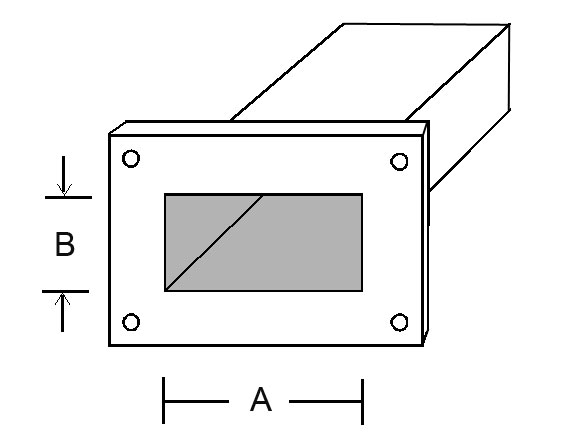

# RF

Dielectric constant of lossy medium
$$ \epsilon_r = \epsilon_r^{\prime} - j\epsilon_r^{\prime\prime} $$

Relative permeability of lossy medium
$$ \mu_r = \mu_r^{\prime} - j\mu_r^{\prime\prime} $$

Propagation constant $\gamma$
$$\begin{aligned}
  \gamma = \alpha + j\beta
  &=& j \frac{\omega}{c_0} \sqrt{\epsilon_r\mu_r} \\
  &=& j \frac{2\pi}{\lambda_0} \sqrt{\epsilon_r\mu_r}
\end{aligned}$$

- Radio wave propagation inside conductive material

When an electric field is applied to Loss Medium has Specific Induction Rate $\epsilon_e$, Conductivity $\sigma$, a Current ($J=\sigma E$) due to conductivity flows in addition to the Displacement Current ($j\omega D$) due to the Electric field $E$ in the lossy medium.

$$\begin{aligned}
  D^* = \frac{1}{j\omega}J + D
  &=& \frac{1}{j\omega}\sigma E + \epsilon_0\epsilon_e E \\
  &=& \epsilon_0(\frac{\sigma}{j\omega\epsilon_0} + \epsilon_e)E \\
  &=& \epsilon_0\epsilon_r E
\end{aligned} $$

Dielectric Constant of conductive material $\epsilon_r$ can be expressed in a form that includes $\sigma$.

$$ \epsilon_r = \epsilon_e - j\frac{\sigma}{\omega\epsilon_0} $$

If $\sigma$ is large, the real part of the relative permittivity can be omitted.

$$ \begin{aligned}
  \epsilon_r
  &\approx& -j\epsilon_r^{\prime\prime} \\
  &=& -j\frac{\sigma}{\omega\epsilon_0}
\end{aligned} $$

$\epsilon_r^{\prime\prime}$ is inversely proportional to $\omega$. This characteristic is unique to a Conductive Material. If the imaginary part is inversely proportional to $\omega$ by measuring the dielectric constant of a material, the material is a conductive material.  
The propagation constant of the large $\sigma$ loss media is as follows.

$$\begin{aligned}
  \gamma
  &=& j \frac{\omega}{c_0} \sqrt{\epsilon_r\mu_r} \\
  &=& j \frac{\omega}{c_0} \sqrt{-j\frac{\sigma\mu_r}{\omega\epsilon_0}} \\
  &=& j \frac{\omega}{c_0} \frac{1-j}{\sqrt{2}} \sqrt{\frac{\sigma\mu_r}{\omega\epsilon_0}} \\
  &=& (1+j) \sqrt{\frac{1}{c_0^2} \frac{\omega\sigma\mu_r}{2\epsilon_0}} \\
  &=& (1+j) \sqrt{\epsilon_0\mu_0 \frac{\omega\sigma\mu_r}{2\epsilon_0}} \\
  &=& (1+j) \sqrt{\frac{\omega\sigma\mu_0\mu_r}{2}} \\
  &=& \frac{1+j}{\delta}
\end{aligned}$$

$\delta$ is called the skin depth.
$$ \delta = \sqrt{\frac{2}{\omega\sigma\mu_0\mu_r}} $$
In particular,
$$ \alpha = \beta = \frac{1}{\delta} $$

One of the characteristics of a conductive medium having a large sigma is that both $\alpha$ and $\beta$ are large and equal.  
The Surface Resistance $R_s$ is expressed as follows.

$$ R_s = \frac{1}{\sigma\delta} $$

The power $P_l$ transmitted from the surface into the conductive medium is expressed as follows.

$$\begin{aligned}
  P_l
  &=& \frac{1}{2} \frac{1}{\sigma\delta} |H_{t0}|^2 \\
  &=& \frac{1}{2} R_s |I_x|^2
\end{aligned}$$

Frequency
|    Freq |           t [s] |        t [ms] |      t [us] |  t [ns] |
| ------: | --------------: | ------------: | ----------: | ------: |
|    1 Hz |           1.0 s |
|    2 Hz |           0.5 s |
|   1 kHz |      1 / 1000 s |        1.0 ms |
|   5 kHz |      1 / 5000 s |        0.2 ms |      200 us |
|  10 kHz |    1 / 10,000 s |        0.1 ms |      100 us |
|  20 kHz |    1 / 20,000 s |       0.05 ms |       50 us |
|  30 kHz |    1 / 30,000 s |       0.03 ms |       33 us |
| 100 kHz |                 |    1 / 100 ms |       10 us |
|   1 MHz |    1 / $10^6$ s |   1 / 1000 ms |        1 us |
|   2 MHz |                 |               |      0.5 us |  500 ns |
|   5 MHz |                 |               |      0.2 us |  200 ns |
|  10 MHz |                 |               |      0.1 us |  100 ns |
|  20 MHz |                 |               |     0.05 us |   50 ns |
| 200 MHz |                 |               |             |    5 ns |
|   1 GHz |    1 / $10^9$ s | 1 / $10^6$ ms | 1 / 1000 us |    1 ns |
| 100 GHz | 1 / $10^{11}$ s | 1 / $10^8$ ms |             | 0.01 ns |

- [us] mean [$\mu s$]

Frequency Wavelength Time
|    Freq |         Wave |     Time |
| ------: | -----------: | -------: |
|    1 Hz | 299,792.5 km |  1.0 sec |
|    2 Hz | 149,896.2 km |  0.5 sec |
|   1 kHz |   299.792 km |   1.0 ms |
|   5 kHz |    59.958 km |   0.2 ms |
|  10 kHz |    29.979 km |   0.1 ms |
|  30 kHz |     9.993 km |    33 us |
|   1 MHz |    299.792 m |     1 us |
|   1 GHz |   299.792 mm | 0.001 us |
| 100 GHz |     2.998 mm |  0.01 ns |
| 200 GHz |     1.499 mm | 0.005 ns |

Conductivity
|      Material       | class          | $\sigma$ [S/m] |
| :-----------------: | :------------- | -------------: |
|         SiC         | Semi-Conductor |
|     Micro-Fiber     | Semi-Conductor |       ~ 7.8E-4 |
|      Sapphire       | Semi-Conductor |       ~ 5.5E-4 |
|      Sea Water      | Semi-Conductor |          ~ 4.0 |
|        GaAs         | Semi-Conductor |      ~ 2.38E-7 |
| Intrinsic Germanium | Semi-Conductor |        ~ 2.227 |
|   Distilled Water   | Insulator      |       ~ 1.0E-4 |
|     Fresh Water     | Semi-Conductor |       ~ 1.0E-2 |
|    Fused Quartz     | Insulator      |      ~ 1.0E-17 |
|     Ceresin Wax     | Insulator      |      ~ 1.0E-17 |
| Human Animal Tissue | Semi-Conductor |    ~ 0.2 - 0.7 |
|       Silver        | Conductor      |         6.1E+7 |
|       Copper        | Conductor      |        5.76E+7 |
|        Gold         | Conductor      |         4.1E+7 |
|    Silicon Steel    | Conductor      |         2.0E+6 |

Dierectric
|     Material     | $\epsilon'_r$ | $\tan(\delta)$ |
| :--------------: | ------------: | -------------: |
| Dehydrated Water |             1 |              0 |
|       Air        |        1.0006 |
|     Sillicon     |          11.8 |
|      Teflon      |           2.1 |         3.0E-4 |
|      Rubber      |        2.5E-3 |         2.0E-3 |
|      Nylon       |           3.5 |         2.0E-2 |
|   Fused Silica   |           3.8 |         7.5E-4 |
| Distrilled Water |            80 |         4.0E-2 |
|    Sea Water     |            81 |           4.62 |

## Waveguide

### Rectanguler Waveguide

<https://www.everythingrf.com/tech-resources/waveguides-sizes>

| EIA | Band [GHz] | Cutoff Low | Cutoff Next |      A x B [mm] |
| --- | ---------: | ---------: | ----------: | --------------: |
| WR8 |   90 ~ 140 |     73.768 |     147.536 |  2.032 x 1.0160 |
| WR6 |  110 ~ 170 |     90.791 |     181.583 |  1.651 x 0.8255 |
| WR7 |  110 ~ 170 |     90.791 |     181.583 |  1.651 x 0.8255 |
| WR5 |  140 ~ 220 |    115.714 |     231.429 | 1.2954 x 0.6477 |

- Waveguide Standard
  - MIL-Spec - United States Military Standard
  - IEC - International Electrotechnical Commission
  - EIA - Electronic Industries Alliance
  - RCSC - Radio Components Standardization Committee

### Circuler Waveguide

- [waveguide](https://www.qwed.eu/CircularWaveguides.pdf)
- Cutoff
  - $$ f_{c, m, n} = \frac{\nu}{2 \pi} \beta_{c, m, n} $$
- TE (H) - mode
  - $$ \beta_{c, m, n} = \frac{\chi^{'}_{m, n}}{a} $$
- TM (E) - mode
  - $$ \beta_{c, m, n} = \frac{\chi_{m, n}}{a} $$
- $TE_{11}$ mode
  - $$ f_{c, TE_{1, 1}} = \frac{c}{2 \pi} \beta_{c, TE_{1, 1}} = \frac{c}{2 \pi} \frac{\chi^{'}_{1, 1}}{a} $$
- $TM_{01}$ mode
  - $$ f_{c, TM_{0, 1}} = \frac{c}{2 \pi} \beta_{c, TM_{0, 1}} = \frac{c}{2 \pi} \frac{\chi_{0, 1}}{a}$$

### Corrugated Circuler Waveguide

### Coaxial Waveguide

- WG Mode
  - Eigenmodes: $e_{mn}$
  - Basis Function at WG aperture: $\hat{Z} \times e_{mn}$
  - Wave Admittance: $Y_{mn}$
  - $\beta$ is imaginary part of Propagation Constant $\gamma=\alpha + j\beta$
  - TE
    - $$ e_{mn}^{TM} = -\nabla_t \Phi_{mn}$$
    - $$ Y_{mn}^{TM} = \frac{H_y}{E_x} = \frac{\beta}{\omega\mu_0} $$
  - TM
    - $$ e_{mn}^{TE} = \hat{z} \times \nabla_t \Psi_{mn}$$
    - $$ Y_{mn}^{TE} = \frac{H_y}{E_x} = \frac{\omega\epsilon}{\beta} $$
  - TEM
    - interior conductor transverse electric and magnetic (TEM) modes
- Circular WG
  - $$ \Phi_{mn} = \sqrt{\frac{\epsilon_m}{\pi}} \frac{J_m(\frac{\chi_{mn}\rho}{a})}{\chi_{mn}J_{m+1}(\chi_{mn})} \cos(m\phi) $$
  - $$ \Psi_{mn} = \sqrt{\frac{\epsilon_m}{\pi}} \frac{1}{\sqrt{\chi_{mn}^{\prime2} - m^2}} \frac{J_m(\frac{\chi_{mn}^{\prime}\rho}{a})}{J_{m}(\chi_{mn}^{\prime})} \cos(m\phi) $$
  - $$ \nabla_t = (\hat{\rho}\frac{\partial}{\partial\rho} + \hat{\Phi}\frac{1}{r}\frac{\partial}{\partial\phi})$$
  - $$ \epsilon_m = \begin{array}{l} 1 & (m=0) \\2 & (m\neq0) \end{array} $$
  - TM
    - $$ e_{mn}^{TM} = \sqrt{\frac{\epsilon_m}{\pi}} \frac{1}{|J_{m+1}(\chi_{mn})|} [ \mp \hat{\rho} \frac{J_m^{\prime}(\frac{\chi_{mn}\rho}{a})}{a} \cos(m\phi) + \hat{\Phi} \frac{m}{\chi_{mn}}\frac{J_m(\frac{\chi_{mn}\rho}{a})}{\rho} \sin(m\phi) ] $$
  - TE
    - $$ e_{mn}^{TE} = \sqrt{\frac{\epsilon_m}{\pi}} \frac{1}{\sqrt{\chi_{mn}^{\prime2}-m^2} |J_m(\chi_{mn}^{\prime})|} [ \pm \hat{\rho} m \frac{J_m(\frac{\chi_{mn}^{\prime}\rho}{a})}{\rho} \cos(m\phi) - \hat{\Phi} \chi_{mn}^{\prime} \frac{J_m^{\prime}(\frac{\chi_{mn}^{\prime}\rho}{a})}{\rho} \sin(m\phi) ] $$
- Coaxial WG
  - $$ \Phi_{mn} = Z_{mn} (\chi_i\frac{\rho}{b}) \cos(m\phi) $$
  - $$ \Psi_{mn} = \mathbb{Z}_{mn} (\chi_i^{\prime}\frac{\rho}{b}) \cos(m\phi) $$
  - $$ \nabla_t = (\hat{\rho}\frac{\partial}{\partial\rho} + \hat{\Phi}\frac{1}{r}\frac{\partial}{\partial\phi})$$
  - $$ Z_{m} (\chi_i\frac{\rho}{b}) = \frac{\sqrt{\pi\epsilon_m}}{2} \frac{J_m(\chi_i\frac{\rho}{b}) N_m(\chi_i) - N_m(\chi_i\frac{\rho}{b}) J_m(\chi_i)}{\sqrt{\frac{J_m^2(\chi_i)}{J_m^2(c\chi_i)}-1}} $$
  - $$ \mathbb{Z}_{m} (\chi_i^{\prime}\frac{\rho}{b}) = \frac{\sqrt{\pi\epsilon_m}}{2} \frac{J_m(\chi_i^{\prime}\frac{\rho}{b}) N_m^{\prime}(\chi_i^{\prime}) - N_m(\chi_i^{\prime}\frac{\rho}{b}) J_m^{\prime}(\chi_i^{\prime})}{\sqrt{[\frac{J_m^{\prime2}(\chi^{\prime}_i)}{J_m^{\prime2}(c\chi^{\prime}_i)}]^2[1-(\frac{m}{c\chi^{\prime}})^2]-[1-(\frac{m}{\chi^{\prime}})^2]}} $$
  - $$ \epsilon_m = \begin{array}{l} 1 & (m=0) \\2 & (m\neq0) \end{array}$$
  - $\chi_i=\chi_{mn}$ is n'th root of $Z_m(c\chi_i)$
  - $\chi_i^{\prime}=\chi_{mn}^{\prime}$ is n'th root of $\mathbb{Z}_{m}(c\chi_i^{\prime})$
    - i.e
    - $\mathbb{Z}_{mn}^{\prime}(\rho\frac{\chi_i^{\prime}}{b})|_{\rho=a}=0$
  - $$ Z_{m}^{\prime} (\chi_i^{\prime}\frac{\rho}{b}) = C_1 [J_{m}^{\prime} (\chi_i\frac{\rho}{b}) N_m(\chi_i) - N_{m}^{\prime} (\chi_i\frac{\rho}{b}) J_m(\chi_i^{\prime})]$$
  - $$ \mathbb{Z}_{m}^{\prime} (\chi_i^{\prime}\frac{\rho}{b}) = C_2 [J_{m}^{\prime} (\chi_i^{\prime}\frac{\rho}{b}) N_m^{\prime}(\chi_i^{\prime}) - N_{m}^{\prime} (\chi_i^{\prime}\frac{\rho}{b}) J_m(\chi_i^{\prime})]$$
  - $\chi_i$ and $\chi_i^{\prime}$ can be found as the respective roots
    - $$ J_{m}(c\chi_i) N_m(\chi_i) - N_{m}(c\chi_i) J_m(\chi_i) = 0 $$
    - $$ J_{m}^{\prime} (c\chi_i^{\prime}) N_m^{\prime}(\chi_i) - N_{m}^{\prime} (c\chi_i^{\prime}) J_m^{\prime}(\chi_i^{\prime}) = 0 $$
  - TM
    - $$ e_{mn}^{TM} = + \hat{\rho} \frac{\chi_i}{b} Z_m^{\prime}(\chi_i\frac{\rho}{b}) \cos(m\phi) - \hat{\Phi} \frac{m}{\rho} Z_m(\chi_i\frac{\rho}{b}) \sin(m\phi) $$
  - TE
    - $$ e_{mn}^{TE} = + \hat{\rho} \frac{m}{\rho} \mathbb{Z}_{mn}(\chi_i\frac{\rho}{b}) \cos(m\phi) - \hat{\Phi} \frac{\chi_i}{b} \mathbb{Z}_{mn}^{\prime}(\chi_i\frac{\rho}{b}) \sin(m\phi) $$
  - TEM
    - $$ e^{TEM} = - \hat{\rho} \frac{1}{\rho\sqrt{2\pi \ln(c)}}$$

## Optics

- Field Expressions for the Electric and Magnetic short dipoles
- well known (e.g. [Stratton, 1941] or [Hansen, 1988].
- Here we will only give the expression for the Huygens source at large distances r,
- $$ E (r, \theta, \phi) = E_0 \frac{\exp(-jkr)}{r} (1 + \cos\theta) (\cos\phi\hat{\Theta} - \sin\phi\hat{\Phi} ) $$
- complex position $(x, y, z) = (0, 0, 0 - jb)$
  - $$ R = \sqrt{x^2 + y^2 + z^2 -b^2 + 2jbz} $$
- In Case,
  - $$ \rho^2 = \sqrt{x^2+y^2} $$
  - $$ z = r\cos \theta $$
  - $$ b \ll r = \sqrt{x^2 + y^2 + z^2} $$
  - Find
  - $$ R \cong \sqrt{ r^2 + j2br\cos\theta} \cong r + jb\cos\theta $$
  - Re-Define
  - $$ u = \exp(kb\cos\theta) \frac{\exp(-jkr)}{r} $$
  - $$ E (r, \theta, \phi) = N_f \exp(kb\cos\theta) \frac{\exp(-jkr)}{kr} (1 + \cos\theta) (\cos\phi\hat{\Theta} - \sin\phi\hat{\Phi} ) $$
  - Beam width is controlled by the parameter $b$
  - set $AdB (A < 0)$ at angle $\theta$
  - $$ b = \frac{20 \log_{10}((1+\cos\theta)/2) - A}{20k(1-\sin\theta)\log_{10}e} $$
  - $$ A = 20 \log_{10}((1+\cos\theta)/2) - 20bk(1-\sin\theta)\log_{10}e$$

### Gaussian Optics

## MoM

- The integral equation used for PEC objects is known
  - as the Mixed-Potential Electric Field Integral Equation (EFIE) formulation.
  - $$ \hat{n} \times E^{i} = \hat{n} \times L_{0} J_{s} $$
  - $$ L_{0}J_{S} = j\omega\mu_0 (\int_{S} J_{S}(r')G_{0}(r, r') dS' + \frac{1}{k_0^2}\int_{S} \nabla_{S}^{'}\cdot J_{S}(r') \nabla G_{0}(r, r') dS') $$
- Galerkin Finite Element Method

### Circularly polarized antenna

TE Mode: The electric field is perpendicular to the propagation direction, and there is no electric field component in the propagation direction.
In the xz-plane, the composition of $H_x$ and $H_y$ is oblique with respect to the z-axis, so the Poynting Vector is oblique with respect to the z-axis. The propagating wave travels while repeating reflection on the wall surface of the waveguide.
Due to this property, the waveguide has an in-tube wavelength in the z-axis direction.
The cutoff frequency determined by the boundary condition of the waveguide outer wall is determined by the cross-sectional length of the waveguide and the relative dielectric constant inside the waveguide.
A rectangular waveguide has the same cutoff frequency in TE Mode and TM Mode, but this state is called degeneracy.

$$ \frac{E_x^2}{|E_x|^2} - 2 \frac{E_x E_y}{|E_x||E_y|} \cos(\delta) + \frac{E_y^2}{|E_y|^2} = \sin^2(\delta) $$
$$ E_x = |E_x| \cos(\omega t) \cos(\delta_x) - |E_x| \sin(\omega t) \sin(\delta_x)$$
$$ E_y = |E_y| \cos(\omega t) \cos(\delta_y) - |E_y| \sin(\omega t) \sin(\delta_y)$$

Phaser
$$ \bm{E}(z) = \left[ \begin{array}{c}
  E_x \\
  E_y
\end{array} \right] = \left[ \begin{array}{c}
  |E_x| \exp^{j \delta_x} \\
  |E_y| \exp^{j \delta_y}
\end{array} \right] \exp^{-jkz} = \left[ \begin{array}{c}
  |E_x| \\
  |E_y| \exp^{j\delta}  
\end{array} \right] \exp^{-jkz} $$

LHCP: Left Hand Circuler Pol
$$ \bm{E_L}(z) = \frac{1}{\sqrt{2}} \left[ \begin{array}{c}
  1 \\
  j
\end{array} \right] $$

RHCP: Right Hand Circuler Pol
$$ \bm{E_R}(z) = \frac{1}{\sqrt{2}} \left[ \begin{array}{c}
  1 \\
  -j
\end{array} \right] $$

Jones Vectro
$$ \left[ \begin{array}{c}
  E_L \\
  E_R
\end{array} \right] = \frac{1}{\sqrt{2}} \left[ \begin{array}{cc}
  1 & j \\
  1 & -j
\end{array} \right] \left[ \begin{array}{c}
  E_x \\
  E_y
\end{array} \right] $$

Stokes Parameter
$$ \bm{S} = \left[ \begin{array}{l}
  S_0 = |E_x|^2 + |E_y|^2 = A^2 \\
  S_1 = |E_x|^2 - |E_y|^2 = A^2 \cos(2\tau) \cos(2\epsilon) \\
  S_2 = 2|E_x||E_y|^2 \cos(\delta) = A^2 \sin(2\tau) \cos(2\epsilon) \\
  S_3 = 2|E_x||E_y|^2 \sin(\delta) = A^2 \sin(2\epsilon)
\end{array} \right] $$

AR: Axis Ratio
$$ AR = \sqrt{\frac{|E_x|^2 \cos^2(\tau) + |E_x||E_y| \sin(2\tau)\cos(\delta) + |E_y|^2 \sin^2(\tau)}{|E_x|^2 \sin^2(\tau) - |E_x||E_y| \sin(2\tau)\cos(\delta) + |E_y|^2 \cos^2(\tau)}} $$

AR may be displayed in db. $AR<3Db$ is often circularly polarized, but AR is closely related to the cross-polarization discrimination XPD, which indicates the magnitude of the difference between the main polarization and cross-polarization.
The evaluation value of AR should be determined taking into account the effect of polarization loss between the transmitting and receiving antennas.

## Irregular Waveguide

Gyro-K, Opti-K, Gyro-KL

Consider the problem of excitation of uniformly filled irregular waveguide, the side surface of which $S_b$ differentfrom regular cylidical surface.

$$ \mathrm{rot}{\bm H} = \epsilon_0 \frac{\partial \bm E}{\partial t} + \bm J $$
$$ \mathrm{rot}{\bm E} = - \mu_0 \frac{\partial \bm H}{\partial t}$$
$$ \left.\left[\bm n, \bm E \right] \right|_{S_b} = \sqrt{\frac{\mu_{\sigma}}{\pi\sigma} } \int_0^t \frac{\partial \left. \left[\bm n, \left[ \bm H, \bm n \right] \right] \right|_{S_b}}{\partial\tau} \frac{d\tau}{\sqrt{t-\tau}} $$

- $\sigma$ - Waveguide Conductivity
- $\mu_{\sigma}$ - Waveguide Magnetic permeability

The Diensity of electric currents $J$ is determined by electron flux.

Introduce a curvilinear coordinate system $\left(r,\phi,s\right)$, connected with waveguide geometry.

- $r,\phi$ - polar coordinate in plane of cross section of waveguide
- $s$ - the arc length of the axis of waveguide

We Call

- $\bm t = \bm r' / |\bm r'|$ - unit vector tangent to waveguide axis
- $\bm n = \bm r'' / |\bm r''| = 1 / k \cdot r''$ - unit normal to waveguide axis
- $\bm b = \bm t \times \bm n$ - binormal to waveguide axis

By Frennes-Serre,

- $\bm t = k \cdot \bm n$
- $\bm n' = -k \cdot t + \tau \cdot \bm b$
- $\bm b' = -\tau \cdot \bm n$
- where
  - $k = 1 / \rho_k = |\bm r''|$ - angular velocity of rotation of the tangent around the binormal
  - $\rho_k$ - radius of curvature
  - $\tau = 1 / \rho_\tau = 1 / k[\bm r'\cdot\bm r''\cdot\bm r''']$ - rotational velocity of binormal round tangent
  - $\rho_\tau$ - torison radius

Certsian rectangular coordinate $(x, y, z)$ inside waveuide are assosiated with entered coordiate $(r, \phi, s)$ using following relation:

$$ \rm r(\rho, \phi, s) = \bm R(s) + \rho r_b(\phi, s) \{ \bm n(s)\cos(\phi) + \bm b(s) \sin(\phi) \} $$

- $\bm r$ - radius-vector of arbitrary point inside waveguide
- $\bm R(s)$ - equation of waveguide axis in Certesian coordinate
- $n(s), b(s)$ - unit vectors of main normal and binormal axis of waveguide
